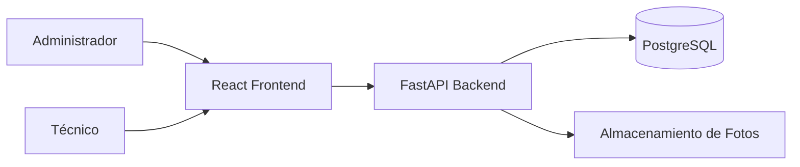
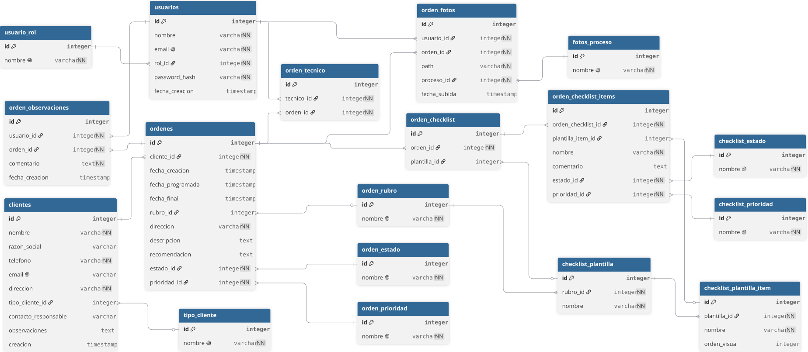

# Arquitectura

## Índice
- [Diagrama General](#diagrama-general)
- [Ficha Ténica](#️-ficha-técnica)
  - [Herramientas](#herramientas)
  - [Lenguajes](#lenguajes)
- [Backend](#backend-python)
  - [Librerías](#librerías)

## Diagrama General



## 🏗️ Ficha Técnica

### Herramientas

<table align="center">
  <tr>
    <td align="center">
      
      <br/>FastApi
      <br/>(Backend)
    </td>
    <td align="center">
      
      <br/>React
      <br/>(Frontend)
    </td>
    <td align="center">
      
      <br/>PostgreSQL
      <br/>(Database)
    </td>
  </tr>
</table>

### Lenguajes

<table align="center">
  <tr>
    <td align="center">
      
      <br/>Typescript
      <br/>(Interfaz)
    </td>
    <td align="center">
      
      <br/>Python
      <br/>(Servidor)
    </td>
  </tr>
</table>

## Backend (Python)

### Estructura

```
backend/
├── app/
│   ├── crud/           # Interacción con Base de datos
│   ├── db/             # Conexión con Base de datos
│   ├── models/         # Modelos SQLAlchemy
│   ├── routers/        # Routers de entrada y salida de datos
│   ├── schemas/        # Esquemas Pydantic
│   ├── services/       # Conexión con Microservicios
│   └── main.py         # Inicio del servidor FastAPI
└── requirements.txt    # Dependencias (fastapi, sqlalchemy, etc.)
```

### Dependencias

> *Se instalan con el "requeriments.txt" en la terminal*
>`pip install -r requirements.txt`

- FastAPI
	- Backend
- Uvicorn
	- Servidor Web
- Psycopg
	- Adaptador PostgreSQL
- Sqlalchemy
	- Interactuar con el SQL con POO
- Pydantic
	- Validación de información entre front y back
- Python-dotnenv
	- Leer .env

##### Autenticación
- Passlib
	- Hashing de contraseña
- Python-JOSE
	- Para manejar tokens de autenticación

##### Imágenes
- Pillow
	- Manipulación de imagenes
- Python-multipart
	- Recibir archivos desde React

##### Facturas y PDFs
- Jinja2
	- Plantillas para HTML
- Weasyprint
	- Convertir HTML a PDF

## Base de Datos

### Diagrama


